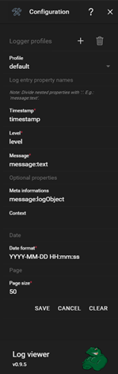
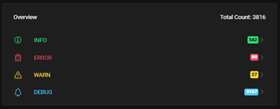
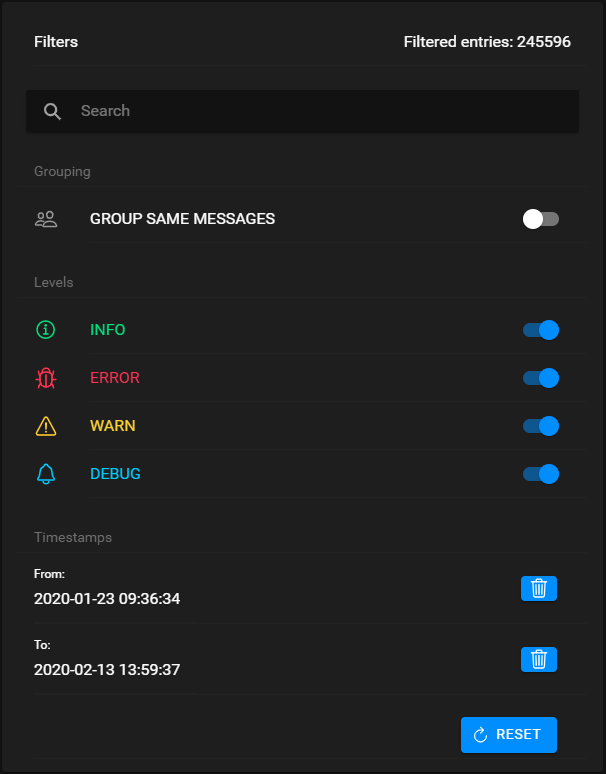
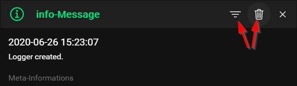

# Log viewer
A simple, configurable and extensible log viewer. Currently only supporting JSON format out of the box, but [others](#extensibility) may come. 

## Table of contents
* [Motivation](#motivation)
  * [Why another log viewer?](#why-another-log-viewer?)
  * [Why ionic?](#why-ionic?)
  * [Why open source?](#why-open-source?)
* [Usage](#usage)
  * [Configuration](#configuration)
    * [Example](#example)
  * [Filtering](#filtering)
    * [Overview](#overview)
    * [Filters](#filters)
    * [Advanced filtering](#advanced-filtering)
* [Extensibility](#usage)
  * [ParserService](#parserservice)
* [Roadmap](#roadmap)
* [Contribution](#contribution)

## Motivation
Before we come to the actual project and its usage I like to use the opportunity to elaborate my motivation behind this.

### Why another log viewer?
Well, yes, there are some log viewers out there already. And I used a few of them in my professional life already. BUT for the last few years I mainly work with electron. So we use [winston](https://www.npmjs.com/package/winston), a, if you go with the weekly downloads alone, pretty famous logger for node. Further we decided to use its JSON format to write our log files. JSON is flexible and even easily human readable. At least if you don´t have a few houndred thousand log entries to read. It is basically screaming "Use me for logs!". 

Anyhoo. Some day the first bug came in. Log file attached. So I grabbed my go to log viewer and took a look how to use it with json. My first suprise. No way to do that. So I thought "ok, let´s take another one". You would expect to find a ton if you google it. That was my second suprise. No, you don´t. Maybe I am just too stupid to google, but most of the time I find what I am looking for. 

I only found one (if you don´t count the overkill stuff you have to pay for):
[json-log-viewer](https://www.npmjs.com/package/json-log-viewer)

Actually I liked it. Retro console style. Only keyboard. I used it for a while. Lacking alternatives. It just had one big flaw. It gets ridiculously slow if your log file has a few MB. I usually deal with 20-100MB per file.

I needed something else. So I took some of that big pile of free time I had thanks to Corona (the virus, not the light beer) and made my own.

### Why ionic?
The lack of a decent log viewer for json formatted logs is only one reason. Actually I just wanted to evaluate and get to know ionic for quite some time now. Especially the new electron integration through capacitor made me curious. Although this experimental feature was kind of sobering. But what is better to get to know a framework than a small test project? 

It might not have been the best choice for this app, especially the date picker is a bad user experience on desktop, but that way I could reach my goal. All in all Ionic is a pretty neat framework. I hit a few bumps, a few things you need to work around, but nothing dramatic. Furthermore it has suprisingly low impact on performance. Even big files are parsed and rendered quite fast.

Long story short. I recommend the framework.

### Why open source?
As developer we rely a lot on open source projects. Tools, libraries and so on and on. Especially in the area of web development a lot of stuff i use at work is just free. I thought this way I can give at least a little bit back. I had fun developing this project and it can be a very helpful tool. So I wanted to make it available for everyone else who is, like me, looking for a tool to make his/her log files readable.

## Usage
Ok, thanks for reading all that stuff above. Except you skipped it. Then shame on you ;)

Let´s dive into it. Actually it is not much to say about how to use the log viewer. Just select a file or drag and drop it to open it. If it is your first use you may want to [configure](#configuration)  it first.

### Configuration
You gonna find the button  to open the configuration sidebar, yes you guessed correct, in the upper right corner. This configuration defines how your log entries are interpreted. Basically the parser just parses every line in your log file into an js object. Now you need to tell it where it can find the rigt properties to display what you want to see.

The configuration looks as follows:

<div style="clear: both">
   
  <ul>
    <li style="margin-bottom: 20px"><b>Profile:</b> You can create multiple profiles for different formats of your logfiles. "+" Adds a new one.</li>
    <li style="margin-bottom: 20px"><b>Timestamp:</b> The name of the property that is representing the timestamp. It will be displayed in the list.</li>
    <li style="margin-bottom: 20px"><b>Level:</b> The name of the property that is representing the used log level. It will be displayed in the list.</li>
    <li style="margin-bottom: 20px"><b>Message:</b> The log message of your object. Yup, also displayed in the list.</li>
  </ul>
  <hr>
  <h4>Optional properties</h4>
  <ul>
    <li style="margin-bottom: 20px"><b>Meta informations:</b> Sometimes you need more than just a message to find a bug. So you log objects like errors or current states of your model etc. Here you can tell the log viewer the name of that property. It will be displayed in a modal when you click on the entry in the list. <i>If it is not defined the complete log entry will be displayed.</i></li>
    <li style="margin-bottom: 20px"><b>Context:</b> We like to log the class name where the log was written as context of the specific message. If you do too, then this is your chance to tell the log viewer where. It will be displayed in the list and the modal. <i>If it is not defined you will not see anything.</i></li>
  </ul>
  <hr>
  <h4>Formatting</h4>
  <ul>
    <li style="margin-bottom: 20px"><b>Date format:</b> Since we all don´t live in the same country and we have different ways to display a date, you can tell the log viewer how you like it. <b>It has nothing to do with the date format inside of your log file. It is just for display purposes. As long as your file contains a parsable date string, it will do. If not, you got a problem.</b></li>
    <li style="margin-bottom: 20px"><b>Page size:</b> You can define here how many log entries you want to see on one page. It has a slight impact on performance. The more there is to be rendered at once, got it?</li>
  </ul>
  <hr>
  <p><b>Note: Except for the meta informations all properties are expected to be a string. If not you will get a "Invalid key" replacer.</b></p>
</div> 
<div style="clear: both"></div>

#### Example
Since we are dealing with JSON I do not expect that your log entries are a flat object. All property keys you define in the config are relative to the object root. If you need to display nested properties, no problem, just seperate them by `:` and you are good to go.

Let us say that our log entry looks something like this:

``` json
{
  "timestamp": "2020-07-01T20:29:37",
  "level": "error",
  "message": {
    "text": "Oh damn! Something bad happend",
    "logObject": {
      "context": "SomeVeryImportantService",
      "msg": "Some exception message",
      "stack": "line xyz"
    }
  }
}
```

Then your configuration needs to look like this:
* Timestamp = timestamp
* level = level
* message = message:text
* meta informations = message:logObject
* context = message:logObject:context

### Filtering

You can filter the list of log entries by various combinable categories.

#### Overview

<div>
   
  <p>The overview card summarizes the total count of all your log entries and also divided by their different log levels. You can click on one of the log levels to isolate it. All other log levels will be filtered out then. The log levels are dynamically created by appearance.</p>
</div> 
<div style="clear: both"></div></br>

#### Filters

<div>
   
  <h4>Filters</h4>
  <p>The filters card gives you the opportunity to filter the log list. The total amount of entries that fit the filters are displayed in the upper right corner.</p>
  <ul>
    <li style="margin-bottom: 20px"><b>Search:</b> You can search the log messages and, if existent, the context.</li>
    <li style="margin-bottom: 20px"><b>Levels:</b> You can deactivate or activate the various log levels. The list is generated dynamically like in the overview.</li>
    <li style="margin-bottom: 20px"><b>Timestamps:</b> You can define the timespan of log entries you are interested in.</li>
  </ul>
</div> 
<div style="clear: both"></div>

#### Advanced filtering
You also have the opportunity to filter specific log messages from the detail modal. After clicking on an entry in the list its details will be shown. In that modal window there are two additional buttons (next to the close button) in the header toolbar:



 Will add a message filter to the filters card so this specific message won´t be displayed anymore. If you wish to include it again, just delete it from the message filter list.

 Will add the complete log message to the search and only show entries that include this specific message.

## Extensibility
Although I created the log viewer for JSON formatted files only, because that was all I needed, I still kept the possibility of extensions in mind. The basic functions like visualization and filtering are seperate from the actual format of the underlying file. Only the [ParserService](#parserservice) needs to be aware of that. This service converts the file content into the internally used `LogEntry` class.

If the logger contains more than one parser you are able to select the format/parser you are interested in after opening a log file.

### ParserService
The `ParserService` is an abstract base class every parser has to extend. 

```js
/**
 * Abstract base class for parser services defining the interface every parser needs to
 * implement.
 */
export abstract class ParserService {
	protected _parseErrorCount;

	/**
	 * Total count of lines that could not be parsed. Hopefully none ;)
	 */
	get parseErrorCount() {
		return this._parseErrorCount;
	}

	/**
	 * The name of the log format this parser is for.
	 */
	get format() {
		return this._format;
	}

	constructor(protected _format: string) {	}

	/**
	 * Parses the given `fileContent` interpreted as the parsers sepcific format to `LogEntry`.
	 *
	 * @param fileContent
	 */
	abstract parse(fileContent: string): Promise<Observable<LogEntry>>;
}
```

Every parser needs to set 2 properties:
1. __parseErrorCount:__ In case some of the lines could not be parsed correctly the `LogService` expects the parser to set the count of these errors at the end of the parsing process. This way the count can be displayed to the user and indicate that there might be something wrong with the log file. The details about the errors can be written to the console.

2. __format:__ Is just a simple string. The name of the format so it can be displayed in the format selection at the beginning. It can be set inside the `super()` call of the deriving class.

The parser needs only the __`parse`__ function. It takes the log file's content as argument. The actual reading of the file is done by the environment specific `FileService` of the log viewer and the parser does not need to care about that. The return value of the function is a `Promise` of an `Observable` of `LogEntries`. This may seem a little bit weird at first look, but the idea behind this is quite simple:

The `Promise` gives you the opportunity of performing `async` actions before starting the actual parsing process. The `Observable` is used to return every `LogEntry` as soon as it is created. So the `LogService` can perform the counting of log levels and building up its list on the fly. This way it is only necessary to iterate once over all entries to build up all informations. The last log file I dealt with had over 240k entries. You get were I am going with this ;).

## Roadmap
Although the workload of my job is getting quite significant again I still plan to extend this project. Especially if there is a demand for it.

The following extensions are planned for the near future (Not necessarily in that order):
* Mobile support. Mainly because i want to play around with capacitor, but it can also be helpful. Imagine you are not at your computer and a tester sends you a log file on slack or whatever. Then you can already take a first look on your phone or tablet.
* Sorting of log entries
* File watcher and displaying the changes in the view (Electron only)

## Contribution
Any feedback is highly welcome. Issues, questions, suggestions for improvement or pull requests for new parser services. Just keep in mind that I have a full time job, so answers or bugfixes may take some time.
